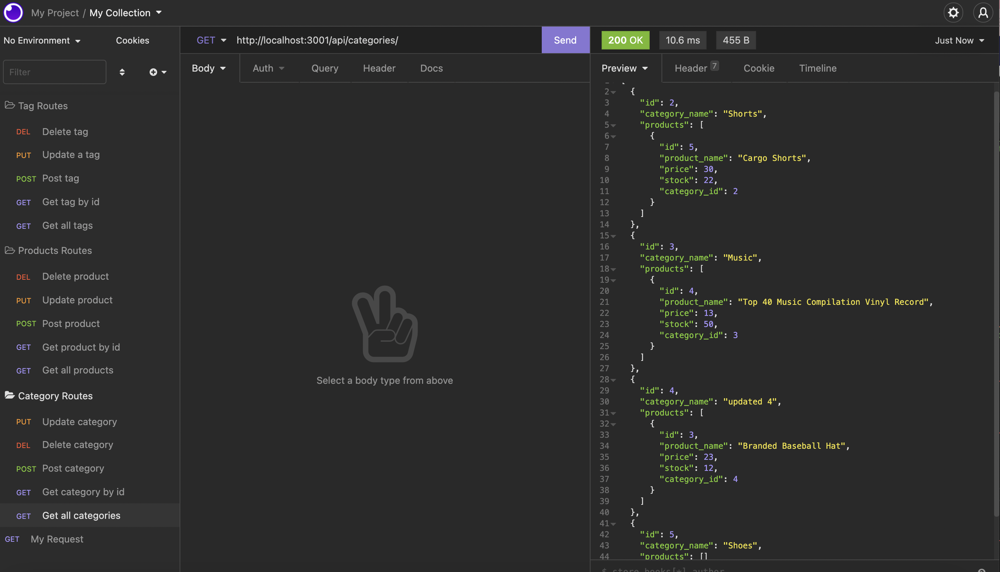
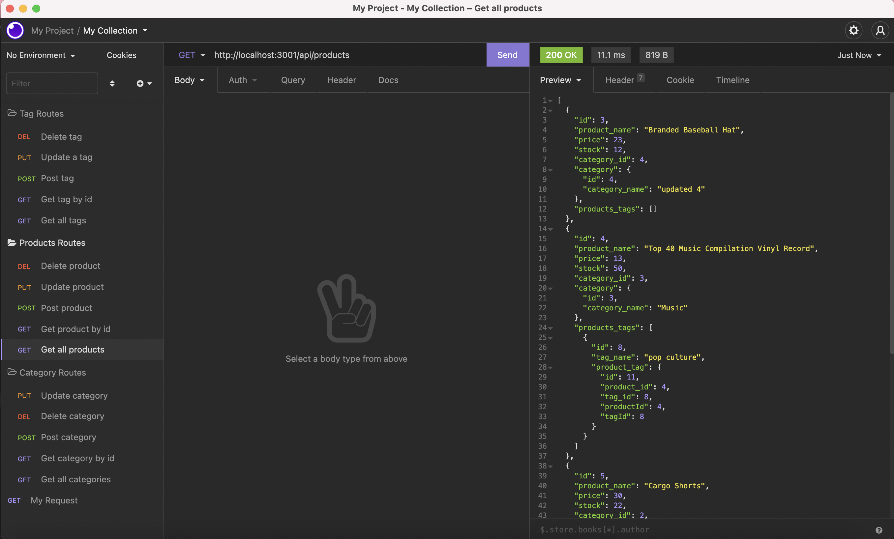
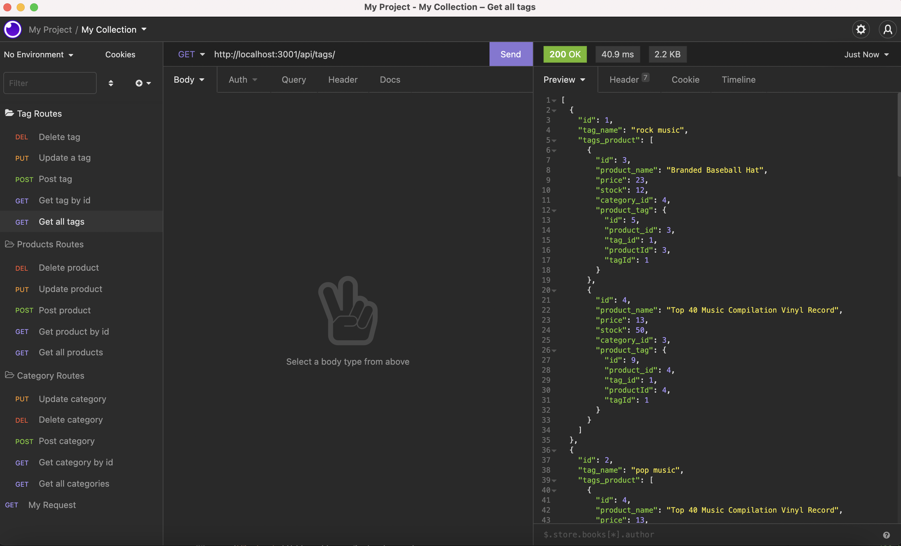
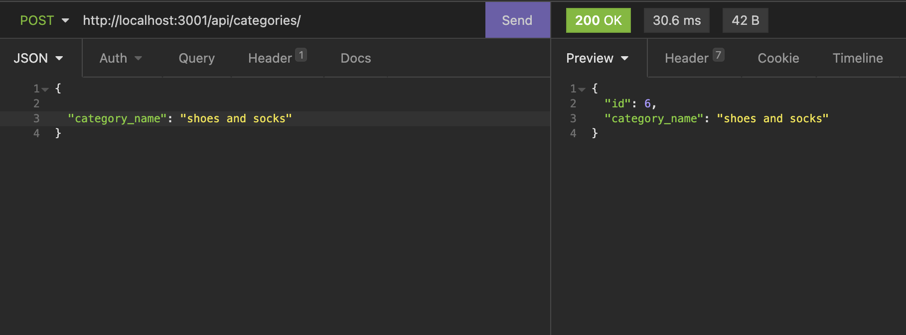
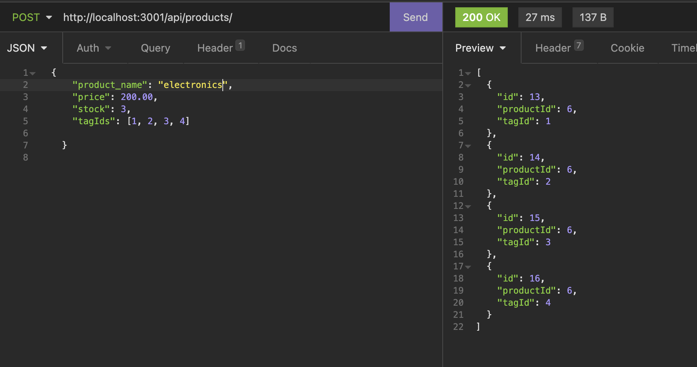
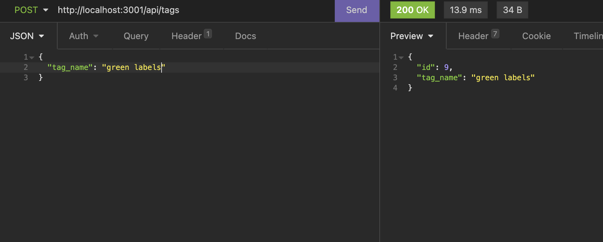
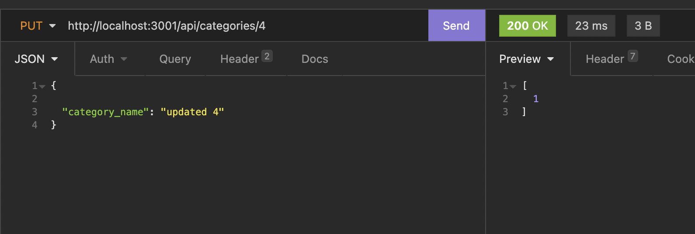
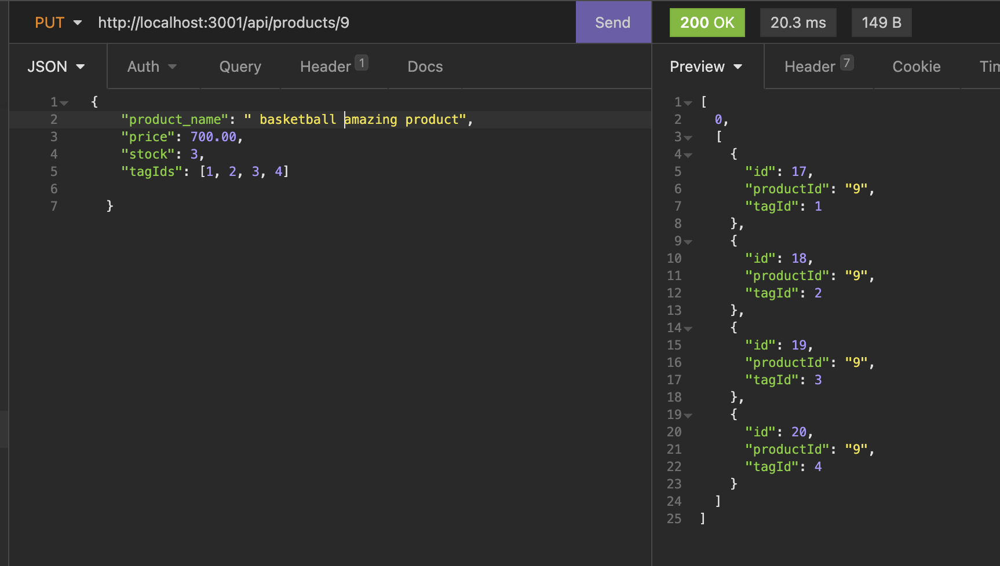
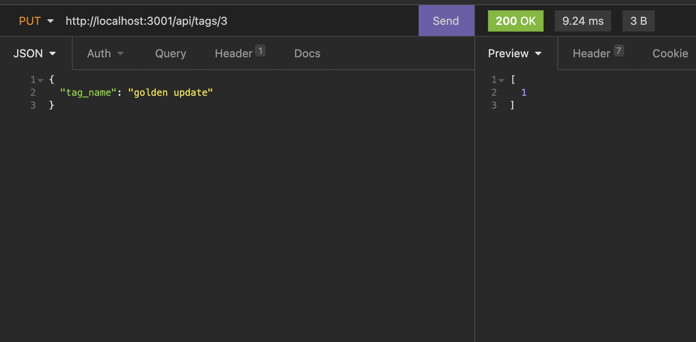

# E-Commerce-Back-End

## Description

In this app, a backend was built for an e-commerce site. Using Sequelize to interact with a MySQL database and Express.js API, we can get, update, post and delete from the databases tables. The database has the following tables: Category, Product, Tag and Product tag as an association table. The routes were testing using Insomnia Core.

## Table of Contents

- [E-Commerce-Back-End](#e-commerce-back-end)
  - [Description](#description)
  - [Table of Contents](#table-of-contents)
  - [Installation](#installation)
  - [Usage](#usage)
  - [GET routes](#get-routes)
  - [POST routes](#post-routes)
  - [PUT routes](#put-routes)
  - [Demo](#demo)
  - [Features](#features)
  - [Built With](#built-with)
  - [Resources Used](#resources-used)
  - [Author](#author)
  - [License](#license)

## Installation

- Go to the app's [repo](https://github.com/imanmansour86/E-Commerce-Back-End) in github and clone the app
- Open the app in VS code, navigate to .env file, change the DB_USER and DB_PW based on current user configurations
- From terminal: navigate to app's directoty and run:

  ```md
  $ npm install
  ```

- From terminal: navigate to db folder in the app's directoty and run:

  ```md
  $ mysql -uroot - p
  ```

- Run the schema file:

  ```md
  source schema.sql
  ```

- From terminal: navigate the app's directoty and run:

  ```md
  $ npm run seed
  ```

- To invoke the app from terminal, run:

  ```md
  $ npm run
  ```

## Usage

Below are some screenshots demonstrating testing the routes in Insomnia

## GET routes

- Categroy



- Product



- Tag



## POST routes

- Categroy



- Product



- Tag



## PUT routes

- Categroy



- Product



- Tag



## Demo

- [Demo Link](https://watch.screencastify.com/v/3NqAKIiVMRTFfE7wytfF)

## Features

## Built With

- [Javascript](https://developer.mozilla.org/en-US/docs/Web/JavaScript)
- [Expressjs](https://expressjs.com/)
- [Sequelize](https://sequelize.org/)
- [MySQL2](https://www.npmjs.com/package/mysql2)
- [dotenv](https://www.npmjs.com/package/dotenv)

## Resources Used

- [W3schools](https://www.w3schools.com)
- [stackoverflow](https://stackoverflow.com)
- [MDN](https://developer.mozilla.org/en-US/docs/Web/CSS)

## Author

Iman Mansour

- [Portfolio](https://imanmansour86.github.io/new-portfolio/)
- [Github](https://github.com/imanmansour86)
- [LinkedIn](https://www.linkedin.com/in/iman-mansour-51391515/)
- [Email](mailto:imanmansour86@gmail.com)

## License

This project is licensed under the MIT License
